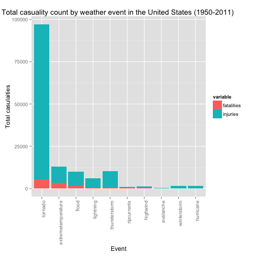
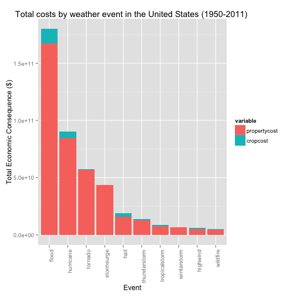

### Synopsis
Storms and other severe weather events can cause both public health and economic problems for communities and municipalities. Many severe events can result in fatalities, injuries, and property damage, and preventing such outcomes to the extent possible is a key concern.The U.S. National Oceanic and Atmospheric Administration's (NOAA) storm database tracks characteristics of major storms and weather events in the United States, including when and where they occur, as well as estimates of any fatalities, injuries, and property damage. This analysis determines from the data, which types of events are most damaging to human and economic health, across the United States. 

### Objective
To determine the weather events that have the largest human and economic impacts in the United States. Human impacts are measured by injuries and deaths resulting from the weather events. Economic impacts are measured by the cost of property and crop damage. 

### Data Obtention and Processing  

The data were obtained from [Storm Data](https://d396qusza40orc.cloudfront.net/repdata%2Fdata%2FStormData.csv.bz2), which span the years 1950 through 2011. For this analysis, the data were processed in four steps:  

1. Reading in and loading the data

```r
packages<-c("ggplot2", "dplyr", "reshape2")
sapply(packages, require, character.only = TRUE)
```

```
##  ggplot2    dplyr reshape2 
##     TRUE     TRUE     TRUE
```

```r
getdata<-function(fileUrl, dir, filename, ext){
        # create directory, if it is not already present
        dirName<-paste(dir, sep = "")
        if(!file.exists(dirName)){
                dir.create(path = dirName)
        }
        # Get the data, unless this step has already been done
        dest<-paste("./",
                    dirName,"/", 
                    filename, 
                    ext, 
                    sep = "")
        if(!file.exists(dest)){
                download.file(url = fileUrl, 
                              destfile = dest, 
                              method = "curl") 
                datedownloaded<-date()
        }
        dest
}
fileURL<-"https://d396qusza40orc.cloudfront.net/repdata%2Fdata%2FStormData.csv.bz2"
data<-getdata(fileUrl = fileURL, 
              dir = "weatherData", 
              filename = "weatherData", 
              ext = ".csv.bz2")
if(!exists("weatherData")){
        weatherData<-read.table(file = bzfile(data), 
                        header = T, 
                        sep = ",")
}
```

2. Subset the resulting data frame to include information only for human and economic impacts, and process the column headers so that they are all in lowercase. 


```r
require(dplyr)
eventData<-subset(x = weatherData, 
                  select = c(EVTYPE, FATALITIES, INJURIES, PROPDMG, PROPDMGEXP, CROPDMG, CROPDMGEXP))
colnames(eventData)<-tolower(names(eventData))
```

3. Clean the data: many event types are duplicated (recorded in both upper and lowercase letters), and many are mis-spelled, or not uniformly labeled, or labeled to include secondary information (eg: hurricane opal vs hurricane errin). 

```r
head(levels(eventData$evtype), 20)
```

```
##  [1] "   HIGH SURF ADVISORY"  " COASTAL FLOOD"        
##  [3] " FLASH FLOOD"           " LIGHTNING"            
##  [5] " TSTM WIND"             " TSTM WIND (G45)"      
##  [7] " WATERSPOUT"            " WIND"                 
##  [9] "?"                      "ABNORMAL WARMTH"       
## [11] "ABNORMALLY DRY"         "ABNORMALLY WET"        
## [13] "ACCUMULATED SNOWFALL"   "AGRICULTURAL FREEZE"   
## [15] "APACHE COUNTY"          "ASTRONOMICAL HIGH TIDE"
## [17] "ASTRONOMICAL LOW TIDE"  "AVALANCE"              
## [19] "AVALANCHE"              "BEACH EROSIN"
```

These were standardized 

```r
# convert all to lowercase
eventData$evtype<-tolower(eventData$evtype)

# standardize labels

# strip all whitespaces and punctuation
eventData$evtype<-gsub(pattern = "[^[:alpha:]]", replacement = "", x = eventData$evtype)

eventData$evtype<-gsub(pattern = "^.*tstm.*$", 
                       replacement = "thunderstormwind", 
                       x = eventData$evtype)
eventData$evtype<-gsub(pattern = "^.*avalanc.*$", 
                       replacement = "avalanche", 
                       x = eventData$evtype)
eventData$evtype<-gsub(pattern = "^.*flood.*$", 
                       replacement = "flood", 
                       x = eventData$evtype)
eventData$evtype<-gsub(pattern = "^.*thunderstormw.*$", 
                       replacement = "thunderstormwinds", 
                       x = eventData$evtype)
eventData$evtype<-gsub(pattern = "^.*thunderstormsw.*$", 
                       replacement = "thunderstormwinds", 
                       x = eventData$evtype)
eventData$evtype<-gsub(pattern = "^.*tunderstormw.*$", 
                       replacement = "thunderstormwinds",
                       x = eventData$evtype)
eventData$evtype<-gsub(pattern = "^.*thunderstorm.*$", 
                       replacement = "thunderstorm", 
                       x = eventData$evtype)
eventData$evtype<-gsub(pattern = "^.*tornado.*$", 
                       replacement = "tornado", 
                       x = eventData$evtype)
eventData$evtype<-gsub(pattern = "^.*hurricane.*$", 
                       replacement = "hurricane", 
                       x = eventData$evtype)
eventData$evtype<-gsub(pattern = "^.*beachero.*$", 
                       replacement = "beacherosion", 
                       x = eventData$evtype)
eventData$evtype<-gsub(pattern = "^.*blizzard.*$", 
                       replacement = "blizzard", 
                       x = eventData$evtype)
eventData$evtype<-gsub(pattern = "^.*lightning.*$", 
                       replacement = "lightning",
                       x = eventData$evtype)
eventData$evtype<-gsub(pattern = "^.*extreme.*$", 
                       replacement = "extremetemperature", 
                       x = eventData$evtype)
eventData$evtype<-gsub(pattern = "^.*excessive.*$", 
                       replacement = "extremetemperature", 
                       x = eventData$evtype)
eventData$evtype<-gsub(pattern = "^.*windchill.*$", 
                       replacement = "windchill",
                       x = eventData$evtype)
eventData$evtype<-gsub(pattern = "^.*severethunderstorm.*$", 
                       replacement = "severethunderstorm", 
                       x = eventData$evtype)
eventData$evtype<-gsub(pattern = "^.*tropicalstorm.*$", 
                       replacement = "tropicalstorm", 
                       x = eventData$evtype)
eventData$evtype<-gsub(pattern = "^.*hvy.*$", 
                       replacement = "heavy", 
                       x = eventData$evtype)
eventData$evtype<-gsub(pattern = "^.*wnd.*$",
                       replacement = "wind", 
                       x = eventData$evtype)
eventData$evtype<-gsub(pattern = "^.*flood.*$",
                       replacement = "flood", 
                       x = eventData$evtype)
eventData$evtype<-gsub(pattern = "^.*heat.*$",
                       replacement = "extremetemperature", 
                       x = eventData$evtype)
eventData$evtype<-gsub(pattern = "^.*cold.*$",
                       replacement = "extremetemperature", 
                       x = eventData$evtype)
eventData$evtype<-gsub(pattern = "^.*rain.*$",
                       replacement = "rain", 
                       x = eventData$evtype)
eventData$evtype<-gsub(pattern = "^.*ice.*$",
                       replacement = "ice", 
                       x = eventData$evtype)
eventData$evtype<-gsub(pattern = "^.*ripcurrent.*$",
                       replacement = "ripcurrents", 
                       x = eventData$evtype)
```

4. Calculating damages: The value of damages to property and crops are encoded by K, M, and B representing thousands, millions and billions of dollars. These were converted to their numerical representation and used to obtain a dollar amount for damage to property and crops, which were stored in propertycost and cropcost columns, respectively. The data was then subsetted to discard irrelevant information
.

```r
eventData$propertycost<-0
eventData$propertycost[eventData$propdmgexp=="K"]<-1000
eventData$propertycost[eventData$propdmgexp=="k"]<-1000
eventData$propertycost[eventData$propdmgexp=="M"]<-1000000
eventData$propertycost[eventData$propdmgexp=="m"]<-1000000
eventData$propertycost[eventData$propdmgexp=="B"]<-1000000000
eventData$propertycost[eventData$propdmgexp=="b"]<-1000000000
eventData<-mutate(eventData, propertycost=propdmg*propertycost)
eventData$cropcost<-0
eventData$cropcost[eventData$cropdmgexp=="K"]<-1000
eventData$cropcost[eventData$cropdmgexp=="k"]<-1000
eventData$cropcost[eventData$cropdmgexp=="M"]<-1000000
eventData$cropcost[eventData$cropdmgexp=="m"]<-1000000
eventData$cropcost[eventData$cropdmgexp=="B"]<-1000000000
eventData$cropcost[eventData$cropdmgexp=="b"]<-1000000000
eventData<-mutate(eventData, cropcost=cropdmg*cropcost)
eventData<-subset(x = eventData, 
                  select = -(propdmg:cropdmgexp))
```

### Obtaining the desired information


```r
## Obtain a barchart for the top ten most injurious weather events

# convert eventData to a long format by variables fatalities and injuries
humanImpact<-melt(data = eventData, 
                  id.vars = "evtype", 
                  measure.vars = c("fatalities", "injuries"))

# cast to a wide format for further subsetting
cast_humanImpact<-dcast(data = humanImpact, 
                        formula = evtype~variable, 
                        fun.aggregate = sum)

# arrange the cast data by both decreasing numbers of injuries and fatalities
casualitiesByEvent<-cast_humanImpact[with(cast_humanImpact, 
                                          order(-fatalities, -injuries)),]

# obtain the top-ten events for both fatalities and injuries
topCasualities<-casualitiesByEvent[1:10,]; rm(casualitiesByEvent)

# convert evtype to a factor variable for plotting
topCasualities$evtype <- factor(topCasualities$evtype, 
                                levels=unique(as.character(topCasualities$evtype)) )

# to facilitate the use of ggplot, melt the resulting data frame
topCasualities<-melt(data = topCasualities, 
                     id.vars = "evtype", 
                     measure.vars = c("fatalities", "injuries"))

# obtain the required plot
g<- ggplot(data=topCasualities,aes(x=evtype, y=value, fill=variable)) 
g<- g + geom_bar(stat = "identity")
g<- g + theme(axis.text.x = element_text(angle = 90, hjust = 1))
g<- g + labs(x="Event", y= "Total casulaities", title = "Total casuality count by weather event in the United States (1950-2011) ")

## Obtain a barchart for the top ten most economically damaging weather events

# convert eventData to a long format by variables propertycost and cropcost
economicImpact<-melt(data = eventData, 
                  id.vars = "evtype", 
                  measure.vars = c("propertycost", "cropcost"))

# cast to a wide format for further subsetting
cast_economicImpact<-dcast(data = economicImpact, 
                        formula = evtype~variable, 
                        fun.aggregate = sum)

# arrange the cast data by both decreasing numbers of cropcost and propertycost
economicsByEvent<-cast_economicImpact[with(cast_economicImpact, 
                                          order(-propertycost, -cropcost)),]

# obtain the top-ten events for both fatalities and injuries
topEconomics<-economicsByEvent[1:10,]; rm(economicsByEvent)

# convert evtype to a factor variable for plotting
topEconomics$evtype <- factor(topEconomics$evtype, 
                                levels=unique(as.character(topEconomics$evtype)) )

# to facilitate the use of ggplot, melt the resulting data frame
topEconomics<-melt(data = topEconomics, 
                     id.vars = "evtype", 
                     measure.vars = c("propertycost", "cropcost"))

# obtain the required plot
gg<- ggplot(data=topEconomics,aes(x=evtype, y=value, fill=variable)) 
gg<- gg + geom_bar(stat = "identity")
gg<- gg + theme(axis.text.x = element_text(angle = 90, hjust = 1))
gg<- gg + labs(x="Event", y= "Total Economic Consequence ($)", title = "Total costs by weather event in the United States (1950-2011) ")
```

### Results
A visual summary of the human health costs by weather event is presented below. 

```r
g
```

 

The plot shows that, in decreasing order of casualties caused, the events which have historically had the greatest human health impact between the years 1950 and 2011 in the United States are

1. tornados
2. extreme temperature
3. flooding
4. lightning
5. thunderstorms
6. rip currents
7. high winds
8. avalanches
9. winter storms
10. hurricanes

A visual summary of the economic costs by weather event is presented below.

```r
gg
```

 

The plot shows that, in decreasing order of economic consequences caused, the events which have historically had the greatest financial impact between the years 1950 and 2011 in the United States are

1. floods
2. hurricanes
3. tornados
4. storm surges
5. hail
6. thunderstorms
7. tropical storms
8. winter storms
9. high winds
10. wildfires

While hurricanes rank relatively low on the list of events that cause many caualities, they are second only to (and possibly often a cause of) the most highly ranked property-damaging event, flooding. The results indicate that floods and tornados are the key events to focus on for disaster preparedness, and it may be wise to also focus on hurricanes. 

These results may be criticised for being too inclusive. Patterns may have shifted since the 1950s, but these data are cumulative, and may not represent the most recent trends. 
